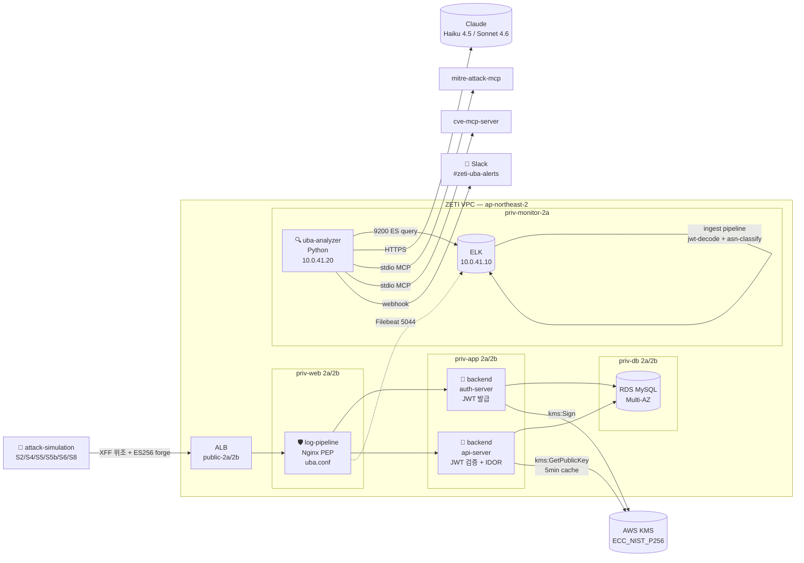
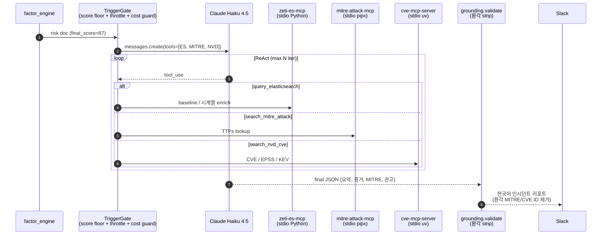

<div align="center">

# 🛡️ ZETTY — Zero Trust + UBA SOC

**Z**ero Trust + S**e**curi**tt**y = **ZETTY**

> **"Never Trust, Always Verify — _and when verify fails, Detect."_**
> 2025 쿠팡 JWT 키 유출 사고 모티브 · 두 축 방어 체계 (KMS 선제차단 + UBA 사후탐지)
> **아주대 캡스톤 · Google × Ajou AI Capstone Design · 파란학기제**

[](https://github.com/ZETTY-ZEROTRUST/backend)
[](https://github.com/ZETTY-ZEROTRUST/uba-analyzer)
[](https://github.com/ZETTY-ZEROTRUST/log-pipeline)
[](https://github.com/ZETTY-ZEROTRUST/attack-simulation)
[](#)

</div>

---

## ⚡ 30초 요약

ZETTY 는 **2025 쿠팡 개인정보 유출 사고** (전직원이 JWT 서명키를 탈취해 7개월간 수천만 건 토큰 위조 — 미탐지) 를 모티브로 한 **두 축 방어 체계** 의 PoC 입니다.

- 🔐 **KMS** = 선제적 차단 (전제조건). 하드코딩 JWT 서명키를 **AWS KMS ES256 (ECC_NIST_P256 비대칭)** 으로 분리 → `kms:Sign` 권한과 `kms:GetPublicKey` 권한 분리로 _키 누출의 영향 면을 축소_
- 🔍 **UBA** = 사후 탐지 (**본체**). 키가 유출되더라도 행위 패턴으로 잡는 **7 팩터 채점 + Claude ReAct + 3 MCP 도구** 의 사용자 행위 분석 엔진
- 🎯 **범위 = 탐지 + 알림 까지**. 차단 / 자동 격리 절대 X (의도). 본 시점에서 PoC 가 증명하려는 것은 _"잡힌다"_
- 🚫 **학습 / 파인튜닝 안 함**. LLM 은 추론만. GPU 예산 0 / 라벨 데이터 0

> 🎯 **멘토 확정 스토리라인**: "사고 조사를 해봤더니 _KMS 키 관리에 문제_ → _KMS로 해결_ → 그럼에도 키가 유출됐을 경우를 대비해 _UBA로 감시·통제_"

---

## 🎬 한 줄 시연 — 6 시나리오 → 5~15 분 후 Slack pop

```bash
# S2 토큰 하이재킹 + 자동 UBA 분석 (~5분 후 Slack pop)
python demo_s2.py

# S5 IP 분산 enum + 자동 UBA 분석 (~5분 후 Slack pop)
python demo_s5.py

# S4 + S6 일괄 시연 (병렬, 시연용)
./run.sh demo
```

| 단계 | 이벤트 | 소요 |
|------|--------|------|
| t=0 | 공격 시나리오 발사 (XFF 위조 트래픽) | 시나리오별 |
| t≈30s | Nginx PEP access.log → Filebeat → ES `filebeat-*` 색인 | 30 초 |
| t=5m | UBA `cron_pipeline.sh` → 7 팩터 채점 | ~30 초 |
| t≈6~7m | Claude Haiku 4.5 ReAct + 3 MCP 도구 → 한국어 인시던트 리포트 | ~1 분 |
| **t=5~15m** | 🔔 **Slack 알람 pop + Kibana 패널 spike** | — |
| 다음날 09:05 KST | Claude Sonnet 4.6 일일 캠페인 인텔리전스 | — |

→ **MTTD = 5~15분** (S4 enumeration) / **6~24h** (S6 Slow & Low)

---

## 🏗️ 전체 아키텍처 — AWS Multi-AZ + 5 레포 협력



### 🔐 SG 체인 (Zero Trust 핵심)

```
alb-sg ──80──> nginx-sg ──8080/8081──> app-sg ──3306──> db-sg
nginx-sg / app-sg ──5044──> elk-sg
uba-sg ──9200──> elk-sg
uba-sg, elk-sg ──443──> 0.0.0.0/0  (NAT → Slack / Anthropic API)
```

> **원칙**: 인바운드는 항상 **SG 참조** (IP 아님). IP 변경 무관, ZT "신원 기반" 에 부합. SSH 키·베스천 없음, **AWS SSM Session Manager** 만 사용.

### 🌐 AWS 인프라 — 단일 VPC Multi-AZ

| Tier | CIDR (2a / 2b) | 워크로드 | 책임 |
|------|---------------|---------|------|
| public | 10.0.1/2.0/24 | ALB, NAT GW | 외부 진입 |
| **priv-web** | 10.0.11/12.0/24 | **Nginx PEP** | PEP — 단일 게이트 |
| **priv-app** | 10.0.21/22.0/24 | **auth-server :8080 / api-server :8081** | JWT 발급·검증 |
| **priv-db** | 10.0.31/32.0/24 | RDS MySQL Multi-AZ | 데이터 |
| **priv-monitor** | 10.0.41/42.0/24 | **ELK + UBA Python** | 관제 |

---

## 📂 5 레포 매트릭스

| 레포 | 언어 | 핵심 책임 | KMS 권한 | ZT 매핑 |
|------|------|-----------|---------|--------|
| [**`backend`**](https://github.com/ZETTY-ZEROTRUST/backend) | Java 17 / Spring Boot 3.5 | Auth + API · **JWT ES256 발급/검증** · 의도된 4 취약점 (IDOR/MOCK OTP/하드코딩 키 잔재) | `kms:Sign` (auth) + `kms:GetPublicKey` (api, 5분 캐시) | 보호 대상 |
| [**`log-pipeline`**](https://github.com/ZETTY-ZEROTRUST/log-pipeline) | Nginx conf / JSON / YAML | Nginx PEP · Filebeat · **ES ingest 2단 chain (jwt-decode + asn-classify)** · 7 ES 매핑 · IaC | — | **PEP** + 관제 |
| [**`uba-analyzer`**](https://github.com/ZETTY-ZEROTRUST/uba-analyzer) | Python 3.11+ | **7 팩터 채점 + Claude ReAct (Haiku 3a / Sonnet 3b)** + 3 MCP 도구 + Slack 알림 | — | **PDP / PIP** |
| [**`attack-simulation`**](https://github.com/ZETTY-ZEROTRUST/attack-simulation) | Python | **6 공격 시나리오** (S2/S4/S5/S5b/S6/S8) · XFF 위조 · ES256 forge · `demo_*.py` 시연 자동화 | — | 검증 트래픽 |
| [**`.github`**](https://github.com/ZETTY-ZEROTRUST/.github) | Markdown | **Org Overview README** (본 문서) | — | — |

### 📦 레포 간 데이터 계약

```mermaid
flowchart LR
    AS[backend<br/>auth-server] -->|11 클레임 JWT| BE_API[backend<br/>api-server]
    AS -.access.log JSON.-> LP[log-pipeline<br/>Nginx PEP]
    BE_API -.access.log JSON.-> LP
    LP -->|filebeat-* 색인<br/>jwt.* + ip_class| UBA[uba-analyzer]
    UBA -->|uba-alerts<br/>+ Slack| SOC[👤 SOC 담당자]
    AT[attack-simulation] -.XFF 위조 트래픽.-> LP
    AT -.forge_token ES256.-> BE_API
```

| 인터페이스 | 생성 | 소비 | 형식 |
|-----------|------|------|------|
| 11 클레임 JWT | `backend/auth-server` | `backend/api-server` + `uba-analyzer` | ES256 Base64URL |
| Nginx access log | `log-pipeline/nginx-pep/uba.conf` | `log-pipeline/filebeat` → ES | JSON 9 필드 (`uba_log`) |
| `jwt.*` 분해된 필드 | `log-pipeline/es-pipelines/jwt-decode` (Painless) | `uba-analyzer` Phase 1 | ES doc |
| `ip_class` (cgnat_kr / cloud / unknown) | `log-pipeline/es-pipelines/asn-classify` (geoip + Painless) | `uba-analyzer` `factor_engine` | ES doc |
| `uba-risk-scores` final_score ≥ 70 | `uba-analyzer` Phase 2 | `uba-analyzer` Phase 3a 폴러 | ES doc |
| `uba-alerts-{date}` | `uba-analyzer` Phase 3a | Slack + Kibana | LLM JSON |

---

## 🪪 JWT 11 클레임 — 쿠팡 실 페이로드 그대로

```json
{
  "sub": "140000511",              // ★ 사용자 ID — 의도된 V2 (순차 정수)
  "jti": "0d93a42a-adbe-4b1f-...", // ★ 토큰 단위 추적자 — UBA token_replay 시그널
  "iat": 1778056393,
  "exp": 1778056993,               // TTL 600초 / 10분 — S8 의 위반 대상
  "iss": "https://auth.zeti.com/",
  "aud": ["https://api.zeti.com"],
  "client_id": "zeti-web",
  "scp": ["openid", "core"],
  "acr": "aal1",                   // 인증 강도 — MFA 우회 탐지 (V4)
  "amr": ["pwd"],                  // 인증 방법
  "ext": {
    "LSID": "d8fa308d-4a3e-...",   // ★★ 세션 단위 추적자 — 단일 세션 다중 IP/토큰 탐지
    "fiat": 1778056393,            // 최초 인증 시각 — 이상 행위 시점 보정
    "v": 2
  }
}
```

> JWT 는 stateless. **`ext.LSID` 가 토큰 안에 박힌 발급 시점 세션 식별자** — 토큰 탈취 시 LSID 매칭으로 패턴 추적 가능 (S2 시나리오의 본질).

---

## 🚨 의도된 4 취약점 — 절대 "수정" 금지

| ID | 위치 | 취약점 | UBA 검증 신호 |
|----|------|--------|--------------|
| **V1** | backend (잔재) | 하드코딩 JWT 서명키 (KMS 전환 전 상태) | 위조 토큰의 비정상 페이로드 검출 |
| **V2** | `User.id : Long` | 순차 정수 PK (`sub = 140000xxx`) | 글로벌 sub 단조 시퀀스 — enumeration factor |
| **V3** | `GET /addresses/{userId}` · `/orders/{userId}` · `/users/{userId}` | JWT `sub` vs path `userId` 일치 검증 누락 = **IDOR** | `F-DiversityIPSub`: 단일 IP × 다수 sub 조회 |
| **V4** | `POST /auth/stepup` | MOCK OTP `"123456"` | step-up 우회 시도 패턴 |

> `door_password` 평문 응답은 V3 의 부속 — **쿠팡 유출 데이터에서 가장 민감한 카테고리** 재현이라 일부러 평문 노출.

**TO-BE**:
- V1 → ✅ **AWS KMS 로 전환 완료** (`backend/auth-server/jwt/KmsJwtSigner.java`)
- V2 → UUID 랜덤 (점진 migration)
- V3 → **UBA 탐지** (차단 아님 — 본 PoC 범위는 _탐지 + 알림_)
- V4 → 실 TOTP / Twilio SMS

---

## 🧮 UBA 7 Factor — 결정론 + 통계 + Override

3 계열로 분류, 각 다른 의미 / cap / 합성식.

| 영문 키 | 한국어 (UI) | 계열 | 타깃 | cap | 발동 조건 |
|---------|------------|------|------|-----|----------|
| `token_violation` | 토큰규격위반 | **결정론** | user | 100 | exp 만료·sub 비정수·iss 불일치·서명 검증 실패 |
| `token_replay` | 토큰재현 | **결정론** | user | 100 | 단일 jti × 다중 IP — ip_country 교차 base 55, ip_class 교차 base 35 + fan-out |
| `request_burst` | 요청수급증 | 통계 (z) | user | 25 | `max(0, z−2) × 5` (cold_start n<100 시 0점) |
| `response_size_burst` | 응답크기급증 | 통계 (z) | user | 30 | `max(0, z−2) × 6` |
| `cumulative_exfil` | 누적유출량 | 통계 (z) | IP | 50 | `max(0, z−2) × 10` (3일 EMA 대비) |
| `ip_user_diversity` | IP-사용자다양성 | **Override** | IP | 100 | 단일 IP × 다수 sub → 즉시 100 (cgnat_kr 화이트리스트 soft cap 30) |
| `response_sensitivity` | 응답민감도 | **Override** | user | 100 | `/api/addresses` 등 민감 endpoint × 비정상 빈도 |

### 최종 점수 합성

```
final_score = min(100, max(
    overrides...,                            # ip_user_diversity / response_sensitivity → 100
    deterministic + 0.3 × Σ(statistical)     # 통계는 보조 신호 (0.3 가중)
))
```

---

## 🤖 LLM 통합 — Haiku 단발 / Sonnet 일일

| Phase | 실행 주기 | 모델 | 평균 토큰 (입/출) | 책임 |
|-------|----------|------|-----------------|------|
| **Phase 3a** (단발 알람) | 1분 cron 폴러 | `claude-haiku-4-5-20251001` | 600 / 1200 | MTTD 5~15분, 1알람 ≤ $0.01 |
| **Phase 3b** (일일 캠페인) | 일 1회 09:05 KST | `claude-sonnet-4-6` | 4000 / 2500 | 장문 캠페인 추론, 위협그룹 추정 |

### ReAct 루프 + 3 MCP 도구



> **중요**: LLM 은 점수 / attacker_level 을 산출하지 **않음**. 그 결정권은 `factor_engine` 만. LLM 은 추론 + 컨텍스트 부여만.

---

## 🎯 공격 시나리오 매트릭스 — 회피 수준별

`attack-simulation` 의 6 시나리오는 **공격자의 회피 수준** 별로 단계화되어 있어, 각 단계가 UBA 의 어떤 factor 가 잡는지를 _데이터로_ 입증:

| 수준 | 시나리오 | 회피 기술 | 잡혀야 할 factor | MTTD 목표 |
|------|---------|----------|------------------|----------|
| 0 (어설픔) | **S4** Enumeration | 회피 없음, 단일 AWS Seoul IP | `ip_user_diversity` override 100 | 5~15분 |
| 1 (IP만 가림) | **S5** Distributed (sub 순차) | IP 분산, sub 순차 | 글로벌 sub 시퀀스 + Route B ASN 다양성 | 15분 |
| 2 (완전 분산) | **S5b** Distributed (sub random) | IP + sub 모두 random | 보완 factor (`F-FirstSeen-Sensitive`) | — |
| 3 (시간 회피) | **S6** Slow & Low | 분당 1~2건 + US Residential IP | `cumulative_exfil` 24h + Impossible Travel | 6~24h |
| 4 (토큰 변형) | **S8** 장수명 토큰 | TTL 7200s = 정상 12배 | `token_violation` T007 (exp-iat>3600) → 80 | 5~15분 |
| ★ | **S2** Token Hijack | 위조 X, 진짜 토큰 + 회선 점프 (KT→Cafe) | `token_replay` (jti 공유 + ip_class 교차) | 5~15분 |

### 🎨 IP 색깔 매트릭스 (prefix 만 봐도 시나리오 식별)

| prefix | 시나리오 | 실제 ASN |
|--------|---------|----------|
| `15.x` | S4 | AWS Asia Pacific (Seoul) AS16509 |
| `98.x` | S6 | US Residential (Comcast 류) |
| `222.x` | S2 victim | KT Corporation AS4766 |
| `101.x` | S2 attacker | Public WiFi / Cafe |
| `203.0.113` / `198.51.100` / `192.0.2` / `45.32.x` | S5 풀 | Mixed Hosting / VPS |

---

## 🛠️ Tech Stack

| 영역 | 스택 | 레포 |
|------|------|------|
| **Language** | Java 17 (Corretto) · Python 3.11+ | backend · uba-analyzer / attack-simulation |
| **Framework** | Spring Boot 3.5 · Spring Security · Gradle (Kotlin DSL) | backend |
| **JWT 라이브러리** | **Nimbus JOSE JWT 9.x** 만 (jjwt 금지) | backend |
| **Crypto** | AWS KMS · `ECC_NIST_P256` · **ES256** 비대칭 | backend |
| **PEP** | Nginx 1.24+ · `set_real_ip_from` + `real_ip_recursive` | log-pipeline |
| **Log Shipper** | Filebeat 8.x · filestream + ndjson parser | log-pipeline |
| **Search Engine** | Elasticsearch 8.x · composable template + ILM · **Painless ingest** | log-pipeline |
| **GeoIP** | MaxMind GeoLite2-ASN + GeoLite2-City | log-pipeline |
| **LLM (단발)** | Anthropic `claude-haiku-4-5-20251001` | uba-analyzer |
| **LLM (일일)** | Anthropic `claude-sonnet-4-6` | uba-analyzer |
| **Tool Use** | Anthropic Messages API ReAct | uba-analyzer |
| **MCP** | stdio transport · `zeti-es-mcp / mitre-attack-mcp / cve-mcp-server` | uba-analyzer |
| **알림** | Slack Incoming Webhook + dedupe + 한국어 리포트 | uba-analyzer/alerting |
| **시각화** | Kibana 8.x · 3-layer 정합 대시보드 | uba-analyzer/infra |
| **AWS** | ALB · EC2 · RDS Multi-AZ · KMS · SSM · S3 · CloudWatch · SNS | log-pipeline/infrastructure |
| **CI/CD** | GitHub Actions (각 레포) | All |
| **IaC** | **Terraform (예정)** — 현재 AWS 콘솔 수기 + `console-changes.md` 기록 | log-pipeline |
| **접근** | AWS Session Manager (SSM) — **SSH 키 없음, 베스천 없음** | All EC2 |

---

## 🧭 Why → How → Impact → Deliverable

### 1️⃣ Why — 쿠팡 사고가 보여준 두 가지 결함

| 결함 | 원인 |
|------|------|
| 7개월 미탐지 | **명확한 룰 기반은 7개월 저속 유출 같은 케이스 못 잡음** (분당 RPS 룰 미달) + 과탐 동반 |
| 키 누출 시 즉시 위조 가능 | **하드코딩 서명키** — 동일 키 = Sign + Verify, 코드/yaml 평문, CloudTrail 감사 없음 |
| 분산 enumeration 사각지대 | 단일 IP factor 모두 0점 — IP 분산하면 무력화 |
| API 인가 누락 | 사용자 ID 순차 9자리 정수 + JWT sub vs path 일치 검증 누락 (IDOR) |
| MFA 우회 | step-up MOCK OTP 시연 |

### 2️⃣ How — 두 축 방어 체계

```
┌─────────────────────────────────────────────────────────────┐
│  KMS 선제차단 (전제조건)                                       │
│  ─────────────────────                                       │
│  • 하드코딩 키 → AWS KMS HSM (export 불가)                     │
│  • 키 분리: kms:Sign (auth) ↔ kms:GetPublicKey (api)         │
│  • 알고리즘: HS256 (대칭) → ES256 (ECC_NIST_P256 비대칭)        │
│  • CloudTrail 자동 감사                                       │
└─────────────────────────────────────────────────────────────┘
                          ↓ "그럼에도 키가 유출됐다면"
┌─────────────────────────────────────────────────────────────┐
│  UBA 사후탐지 (본체)                                          │
│  ────────────────                                            │
│  • 결정론 (token_violation / token_replay) — 룰 매칭 즉시 점수  │
│  • 통계 (z-score 3종) — baseline 분포 대비 (cold_start 보호)   │
│  • Override (ip_user_diversity / response_sensitivity) → 100 │
│  • Claude ReAct + 3 MCP 도구 (ES/MITRE/CVE) + 환각 strip       │
│  • Trigger Gate (score floor + throttle + cost guard)        │
└─────────────────────────────────────────────────────────────┘
```

### 3️⃣ Impact — 정량 KPI

| KPI | Before (쿠팡 시점) | After (ZETI) |
|-----|------------------|-------------|
| 키 누출 시 즉시 위조 가능성 | ✅ (서버 코드에 키) | ❌ (KMS HSM) |
| 키 회전 가능 시점 | 배포 주기 (주 단위) | KMS API 1 콜 |
| 인가 누락 탐지 채널 | **없음** | UBA factor (`F-DiversityIPSub` 등) |
| MTTD (S4 단일 IP enumeration) | 7개월+ (미탐지) | **5~15분** |
| MTTD (S6 Slow & Low) | 7개월+ | **6~24h** |
| LLM 비용 (Phase 3a 1알람) | — | ≤ $0.01 (Haiku 4.5) |
| LLM 환각 MITRE/CVE ID strip | — | `grounding.validate_llm_output` 통과율 100% |
| **두 축 방어 체계 효과** | — | _"키 유출이라도 탐지 + 알림"_ 검증 |

### 4️⃣ Deliverable — SOC 워크플로 즉시 투입 가능한 산출물

| 산출물 | 형식 | 활용 |
|--------|------|------|
| 🔔 **Slack 인시던트 리포트** (Phase 3a) | 한국어 요약 + 증거 + MITRE + 권고 | SOC 담당자 즉시 대응 |
| 🔔 **Slack 일일 요약** (Phase 3b) | 24h 캠페인 분석 + 위협그룹 추정 | 매니저 보고 |
| 📊 **Kibana 대시보드** | 3-layer 정합 (events / risk / alerts) | 분석가 헌팅 |
| 📄 **`uba-alerts-{date}` ES doc** | LLM 산출 JSON 영구 보관 | 감사 추적 / ISMS-P |
| 📄 **`uba-intelligence-{date}` ES doc** | 일일 캠페인 추론 | 보고서 |
| 🎬 **`demo_*.py`** | S2/S5 단독 시연 진입점 + SSM trigger | 발표 영상 |
| 📑 **KPI 측정 데이터** | MTTD / TPR / FPR (`docs/kpi/`) | 학술 보고서 |

---

## 📋 컴플라이언스 / 표준 매핑

| 표준 | 본 시스템 매핑 |
|------|---------------|
| **KISA Zero Trust Guideline 2.0** | PEP (Nginx) + PDP/PIP (UBA `factor_engine` + LLM) — **성숙도 "향상" 단계** 목표 |
| **NIST SP 800-207** | 동적 정책 결정 (baseline + override + LLM 추론) + micro-segmentation (priv-app/priv-db tier) |
| **OWASP Top 10 A01** Broken Access Control | 의도된 IDOR (V3) — UBA 탐지로 보완 |
| **OWASP A02** Cryptographic Failures | AWS KMS HSM + 권한 분리 |
| **MITRE ATT&CK 정렬** | LLM 산출에 technique ID 자동 매핑 + `grounding` 환각 strip · T1078 (S2) / T1199 (S5) / T1110.004 (S4·S5) / T1078.004 (S6) |
| **ISMS-P 침해사고 관리** | `uba-alerts / uba-intelligence` 영구 보관 → 감사 증빙 |
| **금융보안원 C-TAS 호환** | IoC 추출 가능 형식 (IP/ASN/sub/jti) — 외부 인텔 공유 인터페이스 준비 |

---

## 👥 R&R — 본인 단독 진행

명세상 캡스톤 팀 6명 (Team A 2명 + Team B 2명 + 공통 2명) 구조이지만, **실질 모든 트랙 (backend / log-pipeline / uba-analyzer / attack-simulation) 을 본인이 직접 처리**.

| 트랙 | 담당 레포 | 본인 책임 |
|------|----------|----------|
| 백엔드 + 공격 | `backend` + `attack-simulation` | Spring Boot + KMS + 6 시나리오 |
| 관제 인프라 | `log-pipeline` | Nginx PEP + Filebeat + ES ingest + IaC |
| 탐지 엔진 | `uba-analyzer` | factor_engine + LLM ReAct + Slack |

---

## 👀 서비스 타겟층

| 타겟 | 설명 |
|------|------|
| **금융권 SOC 담당자** | 7개월 미탐지 같은 사고를 _두 축 방어_ 로 막고 싶은 실무자 |
| **인프라 엔지니어** | AWS KMS + ES ingest pipeline + UBA 를 코드로 관리 (DevSecOps) |
| **보안 학습자** | 쿠팡 사고를 _실제 인프라 위에서_ 재현·탐지하며 학습하려는 학생·주니어 |

### 🧑‍💼 페르소나 — 보안팀 리더 김보안 (35세)

- 100인 규모 IT 기업의 보안팀장
- 협력사 계정 탈취 / 키 유출 시나리오에 대한 **탐지 채널** 부재를 체감
- 제로트러스트 도입을 경영진에게 제안하고 싶지만, **구체적 효과 데이터** (MTTD / 비용) 부족
- **Needs**: 쿠팡 사고 재현 + UBA 탐지 검증, KPI 정량 데이터 (`docs/kpi/SUMMARY.md`), Slack/Kibana 운영 산출물

---

## 🚀 Getting Started — 다섯 가지 진입점

각 레포는 독립 Git 레포이며, 본 Org overview 는 _전체 그림_ 만 제공합니다. 깊은 내용은 각 레포 README 로.

```bash
# 1) backend — Spring Boot Auth + API
git clone git@github.com:ZETTY-ZEROTRUST/backend.git
cd backend/auth-server && SPRING_PROFILES_ACTIVE=local ./gradlew bootRun     # :8080
cd ../api-server && SPRING_PROFILES_ACTIVE=local ./gradlew bootRun          # :8081
cd ../scripts && ./all.sh                                                    # 8-step 시연

# 2) log-pipeline — Nginx PEP + Filebeat + ES ingest
git clone git@github.com:ZETTY-ZEROTRUST/log-pipeline.git
cd log-pipeline
./scripts/setup-es-ingest.sh && ./scripts/setup-es-uba-indices.sh
./scripts/deploy-nginx-pep.sh

# 3) uba-analyzer — 7 factor + Claude ReAct
git clone git@github.com:ZETTY-ZEROTRUST/uba-analyzer.git
cd uba-analyzer && pip install -r requirements.txt
python3 pipeline.py --hours 72                                               # baseline 시드
python3 llm-agent/orchestrator.py --phase 3a --input llm-agent/sample_alert_3a.json

# 4) attack-simulation — 6 시나리오 + 시연 자동화
git clone git@github.com:ZETTY-ZEROTRUST/attack-simulation.git
cd attack-simulation && pip install -r requirements.txt
python demo_s2.py                                                            # 5분 후 Slack pop
python demo_s5.py
```

| 레포 | 상세 README |
|------|-------------|
| backend | https://github.com/ZETTY-ZEROTRUST/backend#readme |
| log-pipeline | https://github.com/ZETTY-ZEROTRUST/log-pipeline#readme |
| uba-analyzer | https://github.com/ZETTY-ZEROTRUST/uba-analyzer#readme |
| attack-simulation | https://github.com/ZETTY-ZEROTRUST/attack-simulation#readme |

---

## 📜 Commit Convention (Org 표준)

- **포맷**: `<type>(<scope>): <한글 subject>`
- subject: 한글 50자 이내, 마침표 없이, 명령형
- 한 commit = 한 의도. 기능+버그 / 리팩터+기능 분리.

| type | 설명 |
|------|------|
| `feat` | 신규 기능 |
| `fix` | 버그 수정 |
| `docs` | 문서 |
| `chore` | 빌드/IDE/gitignore 등 |
| `refactor` | 리팩토링 |
| `ci` | CI/CD |
| `merge` | 머지 |
| `test` | 테스트 |

| scope | 사용 레포 |
|-------|----------|
| `auth` | backend/auth-server |
| `api` | backend/api-server |
| `uba` | uba-analyzer |
| `pipeline` | log-pipeline ES ingest/매핑 |
| `nginx` | log-pipeline/nginx-pep |
| `infra` | log-pipeline/infrastructure |
| `llm` | uba-analyzer/llm-agent |
| `kms` | KMS 통합 |
| `db` | DB / 마이그레이션 |
| `attack-sim` | attack-simulation |
| `demo` | attack-simulation/demo_*.py |
| `repo` | 레포 구조 변경 |
| `docs` | 문서 |

> 예: `feat(uba): Phase 3a 환각 strip 보강` · `docs(pipeline): asn-classify v11 _meta 정정` · `feat(demo): S2 단독 시연 진입점 추가`

---

## 🚫 절대 규칙 (Org 공통 DO NOT)

- ❌ **의도된 4 취약점에 검증 추가 금지** — V1~V4 는 시연 자산
- ❌ **`door_password` 평문 제거/암호화/마스킹 금지**
- ❌ **JWT 알고리즘 대칭키 (HS256 등) 로 변경 금지** — ES256 + KMS 고정
- ❌ **jjwt 사용 금지** — Nimbus JOSE 만
- ❌ **Maven 마이그레이션 금지** — Gradle 고정
- ❌ **LLM 이 점수 / attacker_level 산출하게 만들지 마라** — `factor_engine` 만 결정
- ❌ **학습 / 파인튜닝 금지** — 추론만
- ❌ **차단 / 자동 격리 코드 추가 금지** — PoC 범위는 _탐지 + 알림_
- ❌ **`leaked-key/*.pem` `*.der` Git 커밋 금지**
- ❌ **자체 인프라 외에서 `attack-simulation` 실행 금지**

---

## 📖 참고 자료

- KISA **제로트러스트 가이드라인 2.0** + 성숙도 모델 2.0
- NIST **SP 800-207** (Zero Trust Architecture)
- OWASP Top 10 (2021) — A01 Broken Access Control · A02 Cryptographic Failures
- MITRE ATT&CK — T1078 / T1199 / T1110 / T1078.004
- Anthropic Claude API — Messages + Tool Use (ReAct)
- Model Context Protocol (MCP) — stdio transport
- 2025 쿠팡 개인정보 유출 사고 (전직원 JWT 키 탈취 → 7개월 미탐지)

---

<div align="center">

### 🔒 **Never Trust · Always Verify · _When Verify Fails, Detect_**

**ZETTY** — Zero Trust + UBA SOC

[`backend`](https://github.com/ZETTY-ZEROTRUST/backend) · [`log-pipeline`](https://github.com/ZETTY-ZEROTRUST/log-pipeline) · [`uba-analyzer`](https://github.com/ZETTY-ZEROTRUST/uba-analyzer) · [`attack-simulation`](https://github.com/ZETTY-ZEROTRUST/attack-simulation)

*Google × Ajou AI Capstone Design · 파란학기제 · 아주대학교*

</div>
